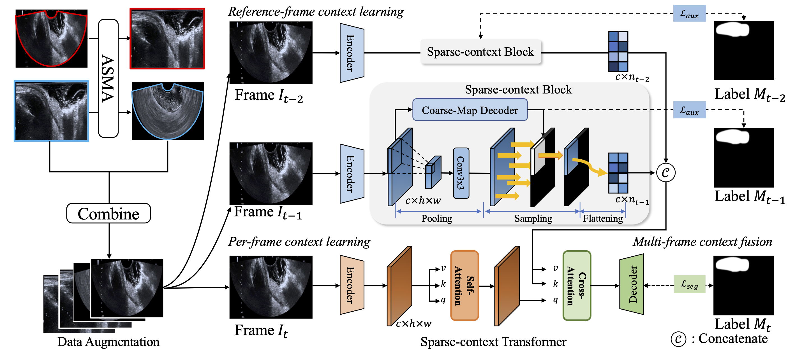

## [Towards a Benchmark for Colorectal Cancer Segmentation in Endorectal Ultrasound Videos: Dataset and Model Development](https://arxiv.org/abs/2408.10067)
by Yuncheng Jiang, Yiwen Hu, Zixun Zhang, Jun Wei, Chun-Mei Feng, Xuemei Tang, Xiang Wan, Yong Liu, Shuguang Cui, Zhen Li

---

## :sparkles: Introduction
 
Endorectal ultrasound (ERUS) is an important imaging modality that provides high reliability for diagnosing the depth and boundary of invasion in colorectal cancer. However, the lack of a large-scale ERUS dataset with high-quality annotations hinders the development of automatic ultrasound diagnostics. In this paper, we collected and annotated the first benchmark dataset that covers diverse ERUS scenarios, *i.e.* colorectal cancer segmentation, detection, and infiltration depth staging. Our ERUS-10K dataset comprises 77 videos and 10,000 high-resolution annotated frames. Based on this dataset, we further introduce a benchmark model for colorectal cancer segmentation, named the **A**daptive **S**parse-context **TR**ansformer (**ASTR**). ASTR is designed based on three considerations: scanning mode discrepancy, temporal information, and low computational complexity. For generalizing to different scanning modes, the adaptive scanning-mode augmentation is proposed to convert between raw sector images and linear scan ones. For mining temporal information, the sparse-context transformer is incorporated to integrate inter-frame local and global features. For reducing computational complexity, the sparse-context block is introduced to extract contextual features from auxiliary frames. Finally, on the benchmark dataset, the proposed ASTR model achieves a 77.6% Dice score in rectal cancer segmentation, largely outperforming previous state-of-the-art methods. 

## :mag: Prerequisites
---
### Clone repository

```shell
# clone project
git clone https://github.com/yuncheng97/ASTR.git
cd ASTR/

# create conda environment and install dependencies
conda env create -f environment.yaml
conda activate ASTR
```

### Download dataset
This database is available for only non-commercial use in research or educational purpose. As long as you use the database for these purposes, you can edit or process images and annotations in this database. Please sign the [license agreement](figs/ERUS-License.pdf) and send it to jyc040204011@gmail.com to obtain the download link.

After download the dataset, put the dataset in the "/data" folder


```shell
mkdir data/
```

### Download pretrained backbone

download the pretrained backbone weights and put them in the "/pretrained" folder
- [Res2Net50](https://drive.google.com/file/d/1RzSdIGhM6kR7yJQWHWy8ed7WNhGrt-m3/view?usp=sharing)
- [PVT_v2_b2](https://drive.google.com/file/d/1I8uPAEzKuI311V_HJpQ7Ppf-LDgi7K_O/view?usp=sharing)


```shell
mkdir pretrained/
```

### Generate augmented dataset
Generate the augmented dataset by *adaptive scanning model augmentation*

The training dataset used in the paper is already generated in the "train_aug" folder. You can use the code to generate other images. Please noted that you need to specify each image as "linear" or "convex"

```shell
python scan_mode_convert.py
```
---


## :rocket: Training and evaluation
Set your own training configuration before training.

**Training on single node**
```shell
    python train.py \
        --gpu_id '0' \
        --batchsize 12 \
        --lr 0.0001 \
        --data_root ./data \
        --train_size 352 \
        --clip_size  3 \
        --backbone res2net50 \
        --scheduler cos \
        --optimizer adamw \
        --epoch 24 \
        --note your_own_experiment_note \
```

**Training on multile nodes**
```shell
python -m torch.distributed.launch --nproc_per_node=2 --master_port=29500 -use_env train.py  \
        --gpu_id '0,1' \
        --batchsize 12 \
        --lr 0.0001 \
        --data_root ./data \
        --train_size 352 \
        --clip_size  3 \
        --backbone res2net50 \
        --scheduler cos \
        --optimizer adamw \
        --epoch 24 \
        --distributed \
        --note your_own_experiment_note \
```
**Evaluation**
```shell
python eval.py \
        --gpu_id '0' \
        --data_root ./data \
        --train_size 352 \
        --clip_size  3 \
        --resume  your_own_trained_model_weight \
        --task Quantitative_or_Qualitative_eval_task \
```

## :pray: Acknowledgement
This code of repository is built on [FLA-Net](https://github.com/jhl-Det/FLA-Net) and [segmentation_models_pytorch](https://github.com/qubvel-org/segmentation_models.pytorch). Thanks for their valuble contributions.

## :book: Citation
- If you find this work is helpful, please cite our paper
```
@article{jiang2024towards,
  title={Towards a Benchmark for Colorectal Cancer Segmentation in Endorectal Ultrasound Videos: Dataset and Model Development},
  author={Jiang, Yuncheng and Hu, Yiwen and Zhang, Zixun and Wei, Jun and Feng, Chun-Mei and Tang, Xuemei and Wan, Xiang and Liu, Yong and Cui, Shuguang and Li, Zhen},
  journal={arXiv preprint arXiv:2408.10067},
  year={2024}
}
```


